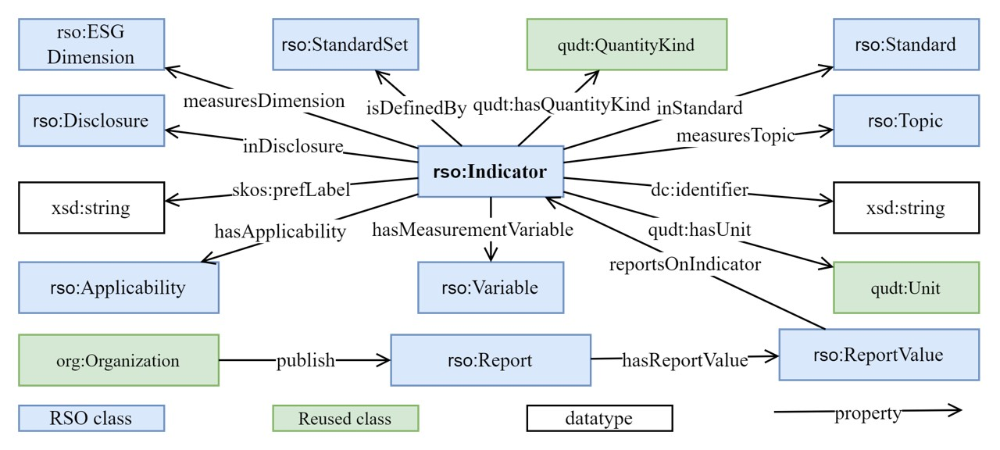

# RSO (Sustainability Reporting Standard Ontology)

The Sustainability Reporting Standard Ontology RSO © 2024 by testmachina is licensed under [CC BY 4.0](https://creativecommons.org/licenses/by/4.0/)

## Access 
* The documentation is available [here](https://tesmachina.github.io/rso.github.io/).
* The ontology (Turtle file) is available [here](ontology-file/rso_blinded.ttl).
* The competency questions and SPARQL queries are availabel [here](cqs-and-sparql-queries).

## Description

RSO is designed  for **mapping quantitative environmental indicators** from the two significant sustainability reporting standards, [GRI](https://www.globalreporting.org/) and [ESRS](https://www.efrag.org/lab6). It formally represents (1) the classification and provenance information of indicators in the GRI and ESRS standards; (2) the requirements for indicators. RSO is envisioned to be integrated into the SME digital infrastructure. Accompanied by suitable digital infrastructure, the reporting system leveraging RSO as a knowledge base will empower the daily tasks of sustainability managers.

The purpose of RSO is to facilitate the interoperability of sustainability standards by indicating the matching and distinct indicators. Indicator mapping will provide further information such as: which report data can be reused for another standard, what distinct requirements exist for the overlapping indicators in two standards, and which distinct indicators are required for the same topic/subtopic by different standards.

## Ontology Schema

The core concepts to formally represent indicator classification, provenance, and requirements defined in the GRI and ESRS standards are described as follows: 
*	**Indicator**: is defined as “a single measure from which conclusions on the phenomenon of interest can be inferred”. 
*	**ESGDimension**: covers the three dimensions of sustainability and is defined as enumerated class.
*	**StandardSet**: models a series of sustainability reporting standards. Exemplary instances are the GRI standards and the ESRS standards.
*	**Standard**: is a piece of standard that is defined by a specific standard setter. For example, the standard GRI 301: Materials 2016 is part of the GRI standards.
*	**Disclosure**: covers indicators that allow an organization to report information about sustainability issues. This class is further subdivided into GRIDisclosure and ESRSDisclosureRequirement based on terms used in each standard respectively.
*	**Topic**: delineates sustainability issues.
*	**Applicability**: indicates whether an indicator is required mandatorily or optionally by the corresponding standard.
*	**Variable**: encompasses a hierarchy of subtopics within specific sustainability areas. It represents a measurable value of a phenomenon, like 'total energy consumption'.
*	**Report**: represents the annual sustainability report published by a certain organization and complies with certain standards. 
*	**ReportValue**: provides a structure to represent a single report data. Each data contains a numerical value and a measurement unit and is linked to a specific indicator.

