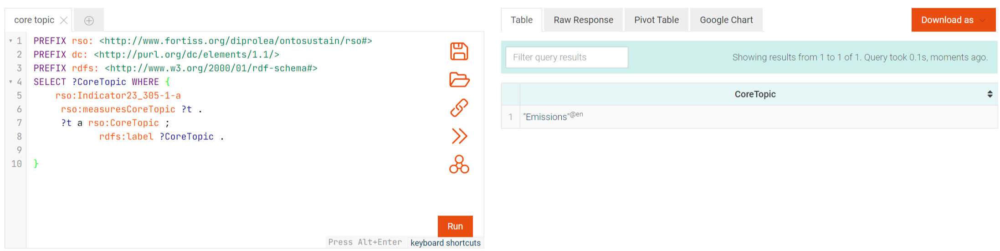

# Competency queries (CQs) and SPARQL query results

> All CQs were evaluated using the KG available at [here](../RSO-examples/).
>
> All SPARQL queries are available at [here](sparql-query-files).
> 

> CQs assume the following individuals:
> 
> Indicator derived from the GRI standard [GRI 305](https://www.globalreporting.org/publications/documents/english/gri-305-emissions-2016/):
> 
> ```<http://www.fortiss.org/diprolea/ontosustain/rsr/gri#Indicator23_305-1-a>```
> 
> Indicator derived from the ESRS standard [ESRS E1](https://www.efrag.org/Assets/Download?assetUrl=%2Fsites%2Fwebpublishing%2FSiteAssets%2F08%2520Draft%2520ESRS%2520E1%2520Climate%2520Change%2520November%25202022.pdf):
> 
> ```<http://www.fortiss.org/diprolea/ontosustain/rsr/esrs#Indicator87_E1-6-45-a>```


## Part I. Indicator Classification and Provenance 

### CQ1. What is the name of the indicator?
[SPARQL query](sparql-query-files/cq1-1-sparql-query.rq)

Result for the GRI indicator:


Result for the ESRS indicator:


### CQ2. What is the identifier of the indicator?
[SPARQL query](sparql-query-files/cq2-1-sparql-query.rq)

Result for the GRI indicator:


Result for the ESRS indicator:


### CQ3. Which standard set defines the indicator?
[SPARQL query](sparql-query-files/cq3-1-sparql-query.rq)

Result for the GRI indicator:


Result for the ESRS indicator:


### CQ4. Which ESG dimension does this indicator measure?
[SPARQL query](sparql-query-files/cq4-1-sparql-query.rq)

Result for the GRI indicator:


Result for the ESRS indicator:


### CQ5. Which Core topic does this indicator measure?
[SPARQL query](sparql-query-files/cq5-1-sparql-query.rq)

Result for the GRI indicator:


Result for the ESRS indicator:


### CQ6. Which specific standard and disclosure define this indicator?
[SPARQL query](sparql-query-files/cq6-1-sparql-query.rq)

Result for the GRI indicator:


Result for the ESRS indicator:


### CQ7. Which topic in the corresponding standard does this indicator measure?
[SPARQL query](sparql-query-files/cq7-1-sparql-query.rq)

Result for the GRI indicator:


Result for the ESRS indicator:


## Part II. Indicator Requirements

### CQ8. What sustainability variable (object) does the indicator measure?
[SPARQL query](sparql-query-files/cq8-1-sparql-query.rq)

Result for the GRI indicator:


Result for the ESRS indicator:


### CQ9. What quantity kind does the indicator measure?
[SPARQL query](sparql-query-files/cq9-1-sparql-query.rq)

Result for the GRI indicator:


Result for the ESRS indicator:


### CQ10. What measurement units are required for this indicator?
[SPARQL query](sparql-query-files/cq10-1-sparql-query.rq)

Result for the GRI indicator:


Result for the ESRS indicator:


### CQ11. Is this indicator mandatorily or optionally required by the corresponding standard?
[SPARQL query](sparql-query-files/cq11-1-sparql-query.rq)

Result for the GRI indicator:


Result for the ESRS indicator:


### CQ12. For the same phenomenon, does the standard require additional information?
[SPARQL query](sparql-query-files/cq12-1-sparql-query.rq)

Result for the GRI indicator:


Result for the ESRS indicator:


### CQ13. If yes, what information is required?
[SPARQL query](sparql-query-files/cq13-sparql-query.rq)


## Part III. Report and Report Values
### CQ14. What information is reported by the organization?
[SPARQL query](sparql-query-files/cq14-sparql-query.rq)

Result for the GRI indicator:


### CQ15. What is the report value of the indicator?
[SPARQL query](sparql-query-files/cq15-1-sparql-query.rq)

Result for the GRI indicator:


## Part IV. Use case: Indicator mapping and Report Value Reuse
### CQ16. What is the corresponding sustainability topic in ESRS for a topic delineated in GRI?
[SPARQL query](sparql-query-files/cq16-sparql-query.rq)


### CQ17. What are indicators associated with each respective topic in both standards?
[SPARQL query](sparql-query-files/cq17-sparql-query-1.rq)

Result for the GRI indicator:

[SPARQL query](sparql-query-files/cq17-sparql-query-2.rq)

Result for the ESRS indicator:


### CQ18. Which indicators in CQ17 overlap in terms of both measuring the same phenomenon and belonging to the same quantity kind?
[SPARQL query](sparql-query-files/cq18-sparql-query.rq)


### CQ19. Do the overlapping indicators found in CQ18 have distinct requirements in each standard? (unit, applicability)
[SPARQL query](sparql-query-files/cq19-sparql-query.rq)


### CQ20. Are there any additional disclosure requirements in any standard for the same measurement phenomenon in CQ17? (sibling)
[SPARQL query](sparql-query-files/cq20-sparql-query.rq)


### CQ21. Are there existing reporting values for overlapping indicators in CQ17 that can be reused irrespective of the required unit?
[SPARQL query](sparql-query-files/cq21-sparql-query.rq)


### CQ22. Which GRI indicators measure broader phenomena than their corresponding ESRS indicators for the related topic?
[SPARQL query](sparql-query-files/cq22-sparql-query.rq)


### CQ23. Which ESRS indicators measure broader phenomena than their corresponding GRI indicators for the related topic?
[SPARQL query](sparql-query-files/cq23-sparql-query.rq)


