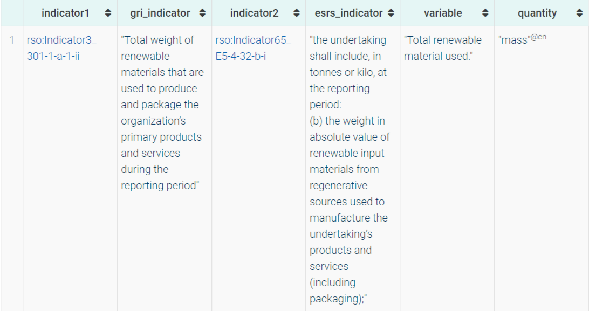

# RSO-based indicator mapping results

## One-to-one mapping result

> In a one-to-one mapping scenario, indicators from different standards measure the same phenomenon and possess identical quantity kinds for that phenomenon. This mapping type primarily focuses on facilitating information reuse, considering two key requirements: the measurement phenomenon and the quantity kind. For instance, if we already possess data on the GRI indicator "the total energy consumption of the organization," we can repurpose this information if the ESRS standard also mandates disclosure of this information. 

one-to-one mapping result for the material topic:

one-to-one mapping result for the energy topic:

one-to-one mapping result for the emissions topic:

one-to-one mapping result for the waste topic:

## One-to-n mapping result
> One-To-N Mapping denotes a scenario where a GRI indicator measures a broader phenomenon within a specific topic compared to several ESRS indicators. In such cases, the value of the GRI indicator necessitates further disaggregation in accordance with ESRS criteria.

one-to-n mapping  result for the energy topic:

one-to-n mapping result for the waste topic:

 
## N-to-one mapping result
> N-to-one mapping signifies instances where several GRI indicators gauge narrower phenomena than a single ESRS indicator within a specific topic. Here, the values of the GRI indicators can be aggregated to derive the value for the ESRS indicator.
> 
N-to-one mapping result for the material topic:
> 

N-to-one mapping result for the waste topic:

